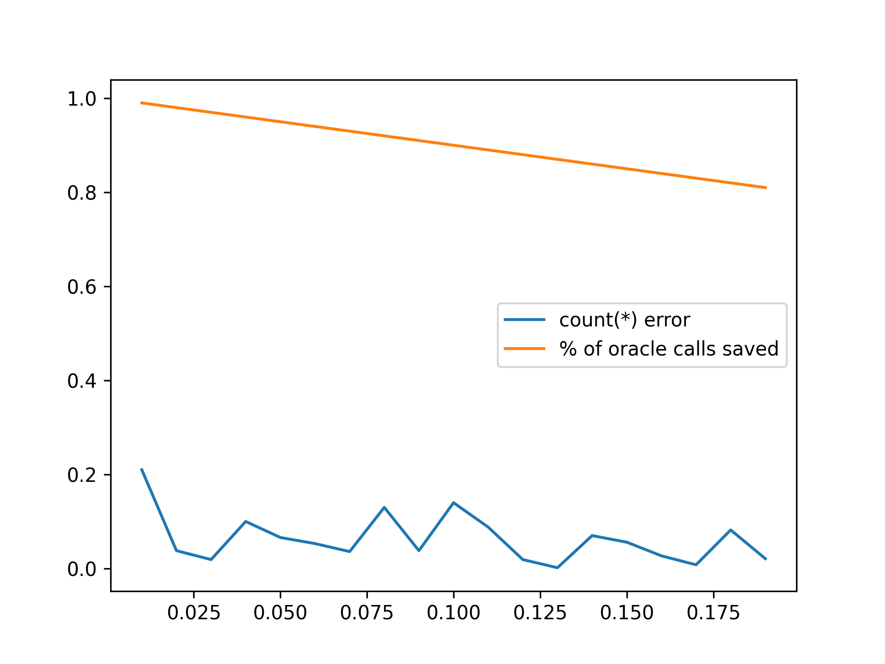
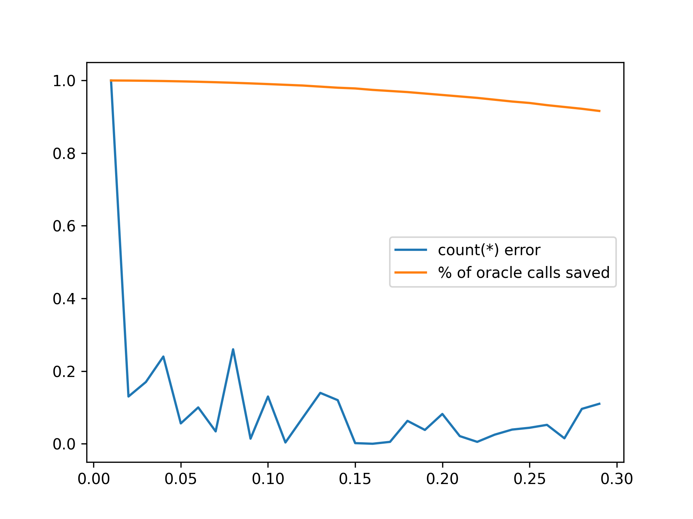

# Evaluating random sampling and ripple join on QQP datasets

Oracle: BERT

Task of QQP: find the number of duplicated question in the dataset

Query:

```sql
SELECT COUNT(*)
FROM QQP q1 JOIN QQP q2
WHERE is_paraphrase(q1, q2) = TRUE
```

Metric:
1. cost: percentage of orcale calls reduced
2. accuracy: (estimated-result - groundtruth) / groundtruth


## Target

First, let's estimate the cost of a general paraphrase detection. Assume the average length of an essay is 40 sentences. ArXiv now has 2326841 articles, which are 9e7 sentences. We want to do paraphrase detection on every 40 sentences of an essay against all sentences in the ArXiv, which is 3e9 pairs.

Considering BERT as our detector, which runs 289.68 samples per second on a `g4dn.xlarge` AWS server (according to MLPerf), costing $0.526 per hour.

By simple math, we can get that the cost for run paraphrase detection on one article is $729714.

e want to decreases to at least $7, which measn we want to reduce 99.999% call to BERT.

## Random sampling

Algorithm: Given a sample ratio `a` and number of total pairs `N` in the dataset, we randomly sample `a*N` pairs and run the oracle on each sampled pairs. We estimate the results by divide the sample results by `a`.

Result:


Observation:
1. The error seems not converge when we increate the sample ratio from 0.01 to 0.2 while the cost increases quickly

## Ripple join

Algorithm: We first randomly shuffle the datasets. Given a increasing sample ratio `a` and number of records in the dataset `M`, we self-join the first `M*a` records. We estimate the results by divide the sample results by `a*a`.

Result:


Observation
1. The error seems acceptable when sample ratio reaches 0.1 while the cost is too high